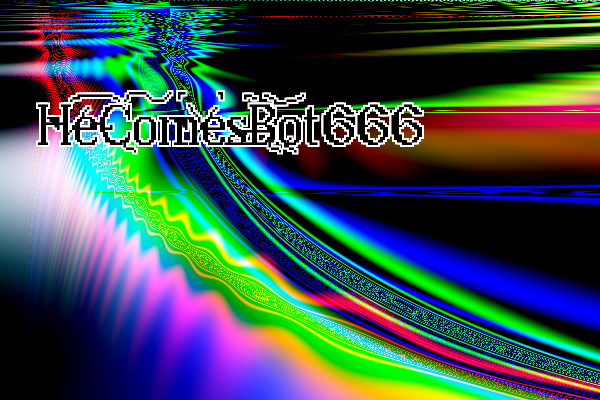

# HeComesBot

Source code for the Facebook bot HeComes Bot 666.



The bot was inspired by an article I read on generating images with python. 

The text file was made by a scraper (not in this source code) and a base file of speeches
which can be found somewhere on GitHub.

It was made to add to my portfolio, I am a Computer Games Development student from the UK.

# Setup

First install Anaconda in your computer. You have the option to not install it, but the used libraries in this repository can conflict with your existing ones. 

To install Anaconda go to [Anaconda's website](https://www.anaconda.com/). You can also install the minimal Anaconda version, [Miniconda](https://docs.conda.io/en/latest/miniconda.html).

Open the **anaconda prompt** and create the environment you will be using to run the bot:
```bash
conda create -n hecomesbot
conda activate hecomesbot
```

Install **pip** and the bot requirements:
```bash
conda install pip
pip install -r requirements.txt
```

Now you are good to go!

# Usage

## Image

You can run `python societybot.py` for the default configuration.
Use `python societybot.py [options]` for configurations. The options are:
* **-s** - Seed for generating images and texts.
* **-d** - Dimensions of the generated image (e.g. `python societybot.py -d 500x500`). Defaults to 512x512
* **-o** - Output path of the generated background image.
* **-f** - Fontsize. Defaults to 40 (fits well with the default image size).
* **-D** - It is a flag. Set it if you want to use the configuration defined at `config.json`. E.g `python societybot.py -D`.
* **-h** - Show help.

The defaults options are limited, for full control use the `-D` flag and change `config.json` and `personality.json` files.

## Video

Script `video.py` can be used to generate videos using the same technique as the images.
Use `python video.py [options]` for configurations. The options are:
* **-n** - Number of videos to create.
* **-f** - FPS.
* **-H** - Height of the video.
* **-W** - Width of the video.
* **-s** - Alpha step. Bigger alphas mean bigger difference in successive frames of the video. Defaults to 0.003.
* **-d** - Duration of the video.

# Advanced configuration

The file `config.json` controls the program variables and the image parameters. The configurable parameters are:

* **quotes_path** - Path to `quotes.txt` file.
* **background_path** - Path to the temporary background image file.
* **output_path** - Path to the temporary output image file (background with text).
* **font_path** - Path to the `*.ttf` font file.
* **history_path** - Path to the folder where you want to save the past generated background and outputs. Set to `null` if you don't want to save them.
* **tree_log_path** - Path to the folder where you want to save the parsing tree of the past generated images. Set to `null` if you don't want to save them.
* **personality_filepath** - Path to the `*.json` personality file.
* **min_sequence_length** - Minimum text length, in characters.
* **max_sequence_length** - Maximum text length, in characters.
* **post_to_facebook** - Can be `true` or `false`. Whether you want to post the image to facebook.
* **post_delay_seconds** - The delay to generate the images, in seconds (e.g. 30min is 1800 seconds).
* **max_depth** - Max depth of the parsing tree. High values (>30) are not recommended.
* **min_depth** - Minimum depth of the parsing tree.
* **dims** - The dimensions of the generated image. It is a list, defaults to `[512, 512]`.
* **markov_model_state_size** - Number of words in the Markov Model state, for generating text. It is the complexity of the markov model. A high value can make the text generation very slow.
* **fontsize** - The font size of the image. Defaults to 40.
* **seed** - Seed for generating image and text. Defaults to `null`, so the bot will generate a new seed for each image. If you input a seed the bot will generate the same image over and over again.
* **restart** - Can be `true` or `false`. Whether you want to delete the past generated images in `history_path` and delete the log file `log.txt`.
* **token** - Token to the facebook API.
* **personality** - Must be `null`. This variable is just a placeholder, don't change it.

# Bot personality

The `personality.json` file is the brain of the bot. It is how it thinks when generating the images. It defines the probability that each function has to be chosen. So setting a high value for `cone` will make the bot generate more circles and ellipsoids in the images, and setting a low value for `sin` and `cos` will make images that are less "curvy".

The outer keys ("0", "1", "2") are the level of the used functions. For example, the level 0 functions are always used when the bot reaches the leaf of the parsing tree, so they are the image's building blocks. Level 1 are the altering functions, they change a image by applying a transformation. Level 2 functions are the merging ones, they take two images (from 2 branches of the parsing tree) and merge them (by adding them, subtrating them, or any operation defined there). Levels greater than 2 can be implemented, and would be transformations that would use more than 2 images as inputs.

Anyways, in the personality file each funtion is assigned with a number. This number reflects the not normalized probability that that function will be randomly picked when the bot builds it's parsing tree. The higher the value, the more often the bot will use it, and a zero value means the bot won't use the function. For example:

* If you set `add: 1` and `subtract: 1`, that means that the `add` and `subtract` functions are equally likely to be chosen. 
* If you set `add: 1`, `rand_color: .5`, `multiply: 2`, that means that the `rand_color` has half of the chance of being chosen, compared to `add`, and that the `multiply` function has double the chance of getting chosen, compared to `add`.

Make sure that for each level at least one function has an assigned probability and keep in mind that at the leaves of the parsing tree only level 0 functions are used (only level 0 are "competing" to be chosen), and that at the branches of the parsing tree all other functions compete with them.

The functions names are self explanatory, but some of them are worthy of being explained:

* **rand_color** - Choses a random color.
* **circle** - Creates a circle in the image, of a random color. The circle has a random position and a random radius.
* **cone** - Creates a cone in the image, of a random color. It is called `cone` because it uses the elliptical cone function, in the image it will appear as a set of concentric circles/ellipses (has a nice visual effect!).
* **sharpen** - Passes a sharpen filter in the image.
* **blur** - Blur the image. Uses a gaussian kernel for convolution.
* **sigmoid** - Apply the sigmoid function. It's output is between 0 and 1.
* **saddle** - Apply the function `x^2 - y^2` (called hyperbolic paraboloid, or saddle function). It is a costly function, so it is advised to set the probability at the personality file to a low value.
* **swap_phase_amplitude** - This is an extremely costly function. It calculates two images FFT, and swaps the phase and the magnitude of them, pixel-wise, them calculates the inverse FFT. It does not always make good images, but it was a fun addition to the function pool.
* **kaileidoscope** - This function is super costly, DON'T use it for images above 400x400 (about 15000 pixels). Or use it wit a very low probability.
* **color_rotate** - This is just a rotation in the space of colors - that means it transforms a set of colors into another. This was implemented due to the tendencies of the bot to generate the R-G-B colors more often.


