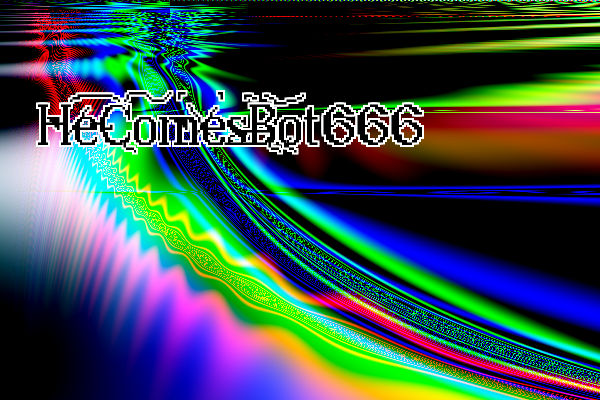

# HeComesBot

Source code for the Facebook bot HeComes Bot 666.



Generates abstract images and videos by building random expression trees over pixel coordinates. The bot was inspired by an article on generating images with Python.

---

## Installation

Requires [Anaconda](https://www.anaconda.com/) or [Miniconda](https://docs.conda.io/en/latest/miniconda.html).

```bash
conda create -n hecomesbot python=3.11
conda activate hecomesbot
pip install -e .
```

For bot functionality (Markov text generation):

```bash
pip install -e ".[bot]"
```

For video generation, [FFmpeg](https://www.ffmpeg.org/) must be installed and accessible in PATH.

---

## Usage

### Web UI

```bash
cd web
python app.py
```

Opens at `http://localhost:5000`. Build and explore trees interactively, preview images, edit nodes, and save/load sessions.

### Standalone image

```bash
hecomes-image [output.png]
```

Options:

| Flag | Description | Default |
|------|-------------|---------|
| `-s`, `--seed` | Random seed | random |
| `-W`, `--width` | Image width | 512 |
| `-H`, `--height` | Image height | 512 |
| `--min-depth` | Minimum tree depth | 6 |
| `--max-depth` | Maximum tree depth | 12 |
| `--alpha` | Leaf delta scale | 4e-3 |
| `-c`, `--color-space` | Color space: `rgb`, `hsv`, `cmy` | `rgb` |
| `--personality` | Personality JSON filename (without `.json`) in `data/personalities/` | `personality` |
| `--gpu` | Evaluate on GPU via CuPy | off |

### Video (delta backend)

Leaves are pre-rendered once; animation is a uniform linear drift on each leaf's output array.
Fastest option; GPU benefit comes from eliminating PCIe leaf-array transfers.

```bash
hecomes-video [options]
```

Options:

| Flag | Description | Default |
|------|-------------|---------|
| `-n`, `--n_videos` | Number of videos | 1 |
| `-f`, `--fps` | Frames per second | 30 |
| `-W`, `--width` | Video width | 256 |
| `-H`, `--height` | Video height | 256 |
| `-d`, `--duration` | Duration in seconds | 10 |
| `-S`, `--seed` | Fixed seed (generates one video) | random |
| `-e`, `--extension` | Output format: `webm`, `mp4`, `avi`, `gif`, `flv`, `ogg`, `mpeg` | `webm` |
| `-b`, `--bitrate` | Constant bitrate | 6M |
| `-C`, `--codec` | Video codec | auto |
| `-p`, `--processes` | Parallel workers | 3 |
| `-c`, `--chunk_size` | Frames per batch | 10 |
| `--min-depth` | Minimum tree depth | 6 |
| `--max-depth` | Maximum tree depth | 12 |
| `--color-space` | Color space: `rgb`, `hsv`, `cmy` | `rgb` |
| `--independent-channels` | One tree per channel (H uses `hsv.json`) | off |
| `--k` | Generate K channel from a tree (CMY only) | off |
| `--alpha` | Generate alpha channel from a tree | off |
| `--personality` | Personality JSON filename (without `.json`) | `personality` |
| `--gpu` | Evaluate on GPU via CuPy | off |

### Video (path animation backend)

Leaf parameters are animated over time via path functions. Richer animation than the delta
backend — positions can orbit, gradients can rotate, colors can cycle through HSV space, and
parameters can follow ODEs. Slower per-chunk (primitives re-render each batch), but uses far
less RAM (no pre-rendered leaf arrays) and is generally faster on GPU.

```bash
hecomes-video-paths [options]
```

All options from `hecomes-video` are supported. Additional options:

| Flag | Description | Default |
|------|-------------|---------|
| `-s`, `--step` | Time multiplier — scales how fast paths evolve (`t = frame × step / fps`) | 0.1 |
| `--path-personality` | Path to a personality JSON containing a `"paths"` section | same as `--personality` |
| `--ode-solver` | ODE integration method: `euler` or `rk4` | `rk4` |
| `--no-paths` | Build path trees but disable all animation (debug baseline) | off |

`--step` controls animation speed independently of frame rate and duration. `step=1.0` means paths advance at wall-clock speed; `step=0.1` (default) slows them down tenfold so a 10-second video traverses only 1 second of path time — useful for slow, smooth motion. Values above 1.0 speed up or compress chaotic ODE trajectories.

#### Path animation

Animation is controlled by the `"paths"` section of a personality JSON:

```json
{
  "weights": { ... },
  "paths": {
    "animation_probability": 0.6,
    "path_weights": {
      "CircularOrbit":   3.0,
      "Oscillate":       2.0,
      "AngularVelocity": 2.0,
      "HuePath":         1.5,
      "LinearDrift":     1.0,
      "LinearODEPath":   0.5
    },
    "omega_range":     [0.5, 4.0],
    "amplitude_range": [0.05, 0.4],
    "primitives": {
      "circle": {
        "animation_probability": 0.9,
        "path_weights": { "CircularOrbit": 6.0, "HuePath": 1.0 }
      },
      "x_var": {
        "path_weights": { "AngularVelocity": 5.0 }
      }
    }
  }
}
```

- `animation_probability` — per animatable parameter, probability of getting a path (vs. staying fixed).
- `path_weights` — relative weights over path types. Types absent or at weight 0 are never chosen.
- `omega_range`, `amplitude_range` — sampling ranges for oscillation frequency and amplitude.
- `primitives` — per-primitive overrides. Any key absent from the override falls back to the top-level value.

#### Available path types

| Type | Animates | Periodic | Description |
|------|----------|----------|-------------|
| `LinearDrift` | any scalar | no | `param(t) = start + rate * t` |
| `Oscillate` | any scalar | yes | `param(t) = base + A·sin(ω·t + φ)` |
| `AngularVelocity` | `angle` | yes | `angle(t) = (angle₀ + ω·t) % 2π` |
| `CircularOrbit` | `cx`, `cy` | yes | Center moves along a circle |
| `HuePath` | `color` | yes | Hue cycles; S and V oscillate independently in HSV space |
| `WaypointPath` | any | optional | Piecewise interpolation through keyframes (`"linear"`, `"step"`, `"cubic"`) |
| `LinearODEPath` | any | no | `dy/dt = A·y + b`; fully serializable |
| `GeneralODEPath` | any | no | User-defined ODE; subclass and register in `PATH_REGISTRY` |

#### Adding a custom path type

```python
import numpy as np
from hecomes.artgen.paths import GeneralODEPath, PATH_REGISTRY

class LorenzPath(GeneralODEPath):
    @property
    def state_dim(self): return 3

    @property
    def param_names(self): return ["cx", "cy", "rx"]

    def y0(self): return np.array([1.0, 0.0, 0.5])

    def _rhs(self, y, t):
        x, yy, z = y
        return np.array([
            10.0 * (yy - x),
            x * (28.0 - z) - yy,
            x * yy - (8/3) * z,
        ])

PATH_REGISTRY["LorenzPath"] = LorenzPath
```

### Instagram bot

Post generated images, Reels, and Stories to Instagram. Requires a Meta developer app with `instagram_content_publish` permission, a Business or Creator account, and a free [Cloudinary](https://cloudinary.com) account for hosting media.

**Install dependencies:**
```bash
pip install -e ".[instagram]"
```

**Set up credentials** in `~/.hecomes_instagram.json`:
```json
{
  "ig_user_id":        "YOUR_NUMERIC_IG_USER_ID",
  "access_token":      "YOUR_LONG_LIVED_ACCESS_TOKEN",
  "cloudinary_cloud":  "YOUR_CLOUD_NAME",
  "cloudinary_key":    "YOUR_API_KEY",
  "cloudinary_secret": "YOUR_API_SECRET"
}
```
Alternatively set `HECOMES_IG_USER_ID`, `HECOMES_IG_ACCESS_TOKEN`, `HECOMES_CLOUDINARY_CLOUD`, `HECOMES_CLOUDINARY_KEY`, `HECOMES_CLOUDINARY_SECRET` as environment variables.

**One-time token setup:**
1. Convert Instagram account to Business or Creator (free, in Instagram settings)
2. Create a Meta app at [developers.facebook.com](https://developers.facebook.com) → add Instagram Graph API product
3. Generate a short-lived token with permissions: `instagram_basic`, `instagram_content_publish`, `pages_read_engagement`
4. Exchange for a long-lived token (60-day expiry):
   ```
   GET https://graph.facebook.com/v21.0/oauth/access_token
     ?grant_type=fb_exchange_token&client_id=APP_ID&client_secret=APP_SECRET&fb_exchange_token=SHORT_TOKEN
   ```
5. Get your numeric user ID: `GET https://graph.instagram.com/v21.0/me?fields=id&access_token=TOKEN`

```bash
hecomes-instagram [options]
```

| Flag | Description | Default |
|------|-------------|---------|
| `--type` | Post type: `image`, `reel`, `story-image`, `story-video` | `image` |
| `--url` | Post an existing public URL instead of generating art | — |
| `--caption` | Post caption (ignored for stories) | empty |
| `--credentials` | Path to credentials JSON | `~/.hecomes_instagram.json` |
| `-S`, `--seed` | Random seed | random |
| `-W`, `--width` | Width in pixels | 512 |
| `-H`, `--height` | Height in pixels | 512 |
| `--personality` | Personality JSON name | `personality` |
| `--path-personality` | Personality JSON with `"paths"` section | same as `--personality` |
| `-d`, `--duration` | `[reel/story-video]` Duration in seconds | 15 |
| `-f`, `--fps` | `[reel/story-video]` Frames per second | 30 |
| `-s`, `--step` | `[reel/story-video]` Path time multiplier | 0.1 |
| `-e`, `--extension` | `[reel/story-video]` Video format | `mp4` |
| `-b`, `--bitrate` | `[reel/story-video]` Constant bitrate | `6M` |
| `-p`, `--processes` | `[reel/story-video]` Parallel workers | 3 |

**Aspect ratio requirements:**
- `image`: 4:5 to 1.91:1 (square 1:1 works); 512×512 is fine
- `reel`: 9:16 required — use `-W 540 -H 960`
- `story-image` / `story-video`: 9:16 recommended — use `-W 540 -H 960`

**Examples:**
```bash
# Generate and post
hecomes-instagram --type image --caption "Generated art"
hecomes-instagram --type reel -W 540 -H 960 -d 15 --caption "Animation"
hecomes-instagram --type story-image -W 540 -H 960
hecomes-instagram --type story-video -W 540 -H 960 -d 30

# Post an existing public URL (skips generation)
hecomes-instagram --url https://example.com/photo.jpg --caption "My art"
hecomes-instagram --url https://example.com/clip.mp4 --type reel
hecomes-instagram --url https://example.com/story.jpg --type story-image
```

### Bot (legacy)

```bash
python -m hecomes.bot.main [options]
```

Options: `-s` seed, `-d` dimensions, `-o` output path, `-f` fontsize, `-D` use `config.json`.

---

## Color spaces

- **rgb** — default, channels clipped to [0, 1].
- **hsv** — H is circular (wraps), S/V are clipped. `--independent-channels` builds a separate tree per channel; H uses `personality_h.json` which enables circular hue functions.
- **cmy** — inverted RGB. `--k` adds a K (black) channel tree.

---

## Personality files

Personality files are JSON documents in `data/personalities/`. They control two things:

**Tree structure weights** — the probability of each function being selected when building the expression tree. Each function is assigned a weight; higher means more likely, zero means never used.

- `personality.json` — used for RGB/CMY generation and for S/V channels in HSV mode.
- `hsv.json` — used for the H channel in `--independent-channels` HSV mode. Enables circular hue functions.

**Path animation config** (optional, `hecomes-video-paths` only) — an optional top-level `"paths"` key controls how leaf parameters are animated. See the [path animation section](#path-animation) above for the full structure. Per-primitive overrides are supported under `"paths": { "primitives": { "circle": { ... } } }`.

The functions are grouped by arity:

- **Arity 0 (leaves):** produce a base image — `rand_color`, `x_var`, `y_var`, `circle`, `cone`, `sphere`.
- **Arity 1 (unary):** transform one image — `blur`, `sharpen`, `sigmoid`, `mirrored_sigmoid`, `absolute_value`, `color_rotate`, `kaleidoscope`, `swirl`, `ripple`, `pinch`, `polar_warp`.
- **Arity 2 (binary):** combine two images — `add`, `subtract`, `multiply`, `safe_divide`, `safe_modulus`, `saddle`, `swap_phase_amplitude`, `circular_mean`, `circular_mean_far`, `hue_diff`, `hue_rotate`.
- **Arity 3 (ternary):** combine three images — `blend`, `rgb_compose`, `warp_by`.

Notable functions:

- **cone** — elliptical cone function; produces concentric circles/ellipses.
- **sphere** — soft radial gradient, falls off as the distance from center grows.
- **saddle** — hyperbolic paraboloid (`x² - y²`). Costly; use low probability.
- **swap_phase_amplitude** — swaps FFT phase/magnitude between two images. Very costly.
- **kaleidoscope** — not recommended above 400×400.
- **color_rotate** — rotation in color space; helps diversify away from pure R/G/B outputs.
- **circular_mean / circular_mean_far** — mean of two hue values along the shorter/longer arc.
- **hue_diff** — angular distance between two hue values, in [0, 0.5].
- **hue_rotate** — circular addition of hue values.

#### Pixel warp operators

All warp operators use backward mapping: for each output pixel at `(x, y)`, they compute a source coordinate `(x_src, y_src)` and sample the input via bilinear interpolation. Out-of-bounds coordinates are clamped to the image edge.

- **swirl** — rotates pixels around a center point. Rotation angle at radius `r` is `strength × r^power`. Negative power (e.g. `-2`) gives inner-faster rotation (black hole); positive gives outer-faster (galaxy spiral). Params: `cx`, `cy`, `strength`, `power`.
- **ripple** — sinusoidal displacement: `x_src = x + ax·sin(kx·y + phase_x)`, `y_src = y + ay·sin(ky·x + phase_y)`. The phase params are animatable — advancing them over time creates flowing water or flag-waving effects. Params: `ax`, `ay`, `kx`, `ky`, `phase_x`, `phase_y`.
- **pinch** — radial lens distortion. Source radius `r_src = r^(1 + strength)`. Positive strength: content from the center spreads outward (bulge/fisheye). Negative strength: content is pulled inward (pinch/pincushion). Params: `cx`, `cy`, `strength`.
- **polar_warp** — remaps the image from Cartesian to polar coordinates centered at `(cx, cy)`. The angular coordinate of each output pixel indexes the horizontal axis of the source; the radial coordinate indexes the vertical axis. Circular or radially symmetric content in the source gets "unrolled" into rectangular bands.

#### Ternary operators

- **blend(a, b, mask)** — per-pixel mix: `a × clip(mask, 0, 1) + b × (1 − clip(mask, 0, 1))`. The mask is a full tree-generated image; its pixel values determine which source dominates at each location. Bright regions in the mask show `a`; dark regions show `b`.
- **rgb_compose(a, b, c)** — collapses each input to a luminance scalar (BT.709 weights) and assembles R, G, B from the three subtrees respectively. Gives independent per-channel control that no binary combination can achieve.
- **warp_by(img, dx_field, dy_field)** — data-driven pixel warp. For each output pixel at `(x, y)`, the luminance of `dx_field` and `dy_field` at that position gives the displacement: `x_src = x + amplitude × lum(dx_field)`, `y_src = y + amplitude × lum(dy_field)`. The displacement fields are themselves tree-generated images, so the warp shape inherits the structure of those subtrees — e.g. a `swirl` output as a field produces a spiral-shaped warp, a `cone` produces radial displacement. Param: `amplitude`.
